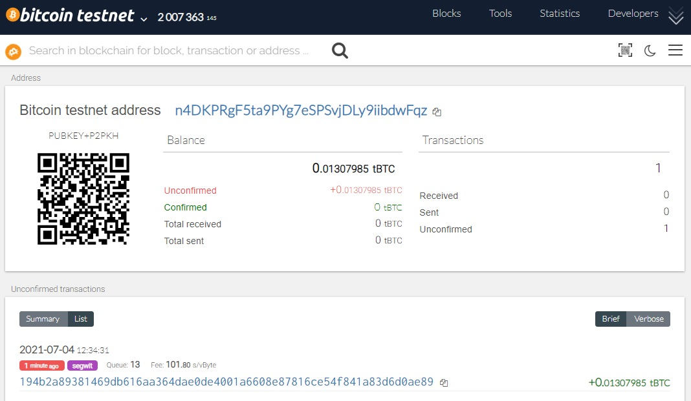
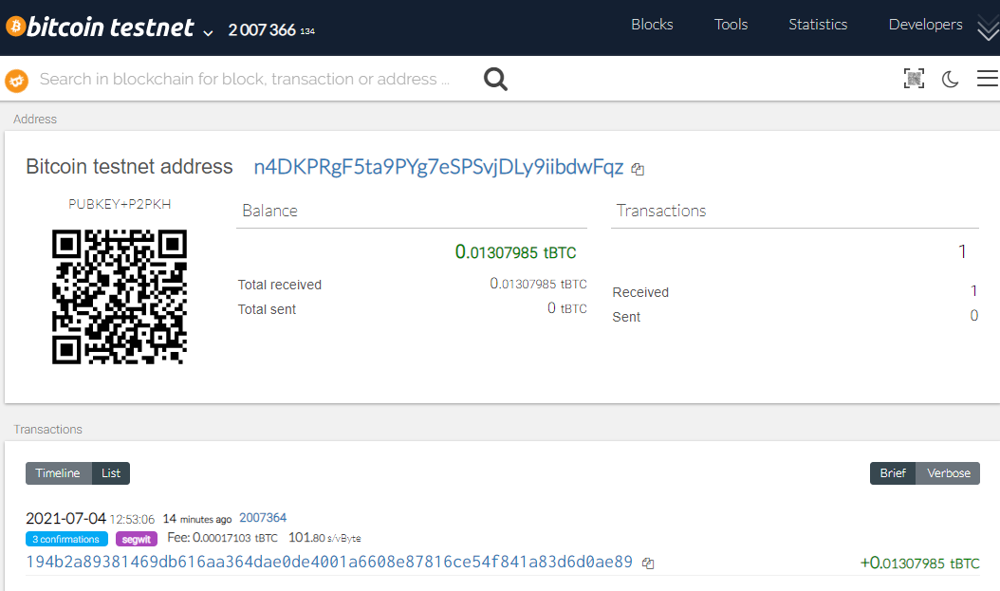

# Multi-coin Python Wallet

This project contains a Python wallet that supports Ethereum and BTC testnet transactions.
This uses the BIP44 standard, and uses the following libraries:

- ['hd-wallet-derive'](https://github.com/dan-da/hd-wallet-derive) BIP44 Command Line tool that supports 300+ coins
- ['bit'](https://ofek.github.io/bit/) Python Bitcoin library
- ['web3.py'](https://github.com/ethereum/web3.py) Python Ethereum library

## Installation

You will need PHP and Python 3 on your system.
First, install Python dependencies using pip:

pip install -r requirements.txt

Then, clone and install `hd-wallet-derive`. Instructions available [here](https://github.com/dan-da/hd-wallet-derive#installation-and-running).

Installation guide via GitBash:  
git clone https://github.com/dan-da/hd-wallet-derive
cd hd-wallet-derive
php -r "readfile('https://getcomposer.org/installer');" | php
php composer.phar install

Create a symlink called derive:
ln -s hd-wallet-derive/hd-wallet-derive.php derive

To use the wallet, set an account:
account = priv_key_to_account(BTCTEST, coins[BTCTEST][0]['privkey'])

Then, send a transaction by doing:
send_tx(BTCTEST, account, 'recipient address', '0.001')

The 'coins' object contains a list of child wallets for each coin, in this case 'BTCTEST' and 'ETH'.  
Image to be inserted as I could not get it to work.

Funding BTCTEST address from faucet https://coinfaucet.eu/en/btc-testnet/

Here is an example `BTCTEST` transaction on testnet:
Image to be inserted as I could not get it to work.

Here is an example `ETH` transaction on a local testnet:
Image to be inserted as I could not get it to work.